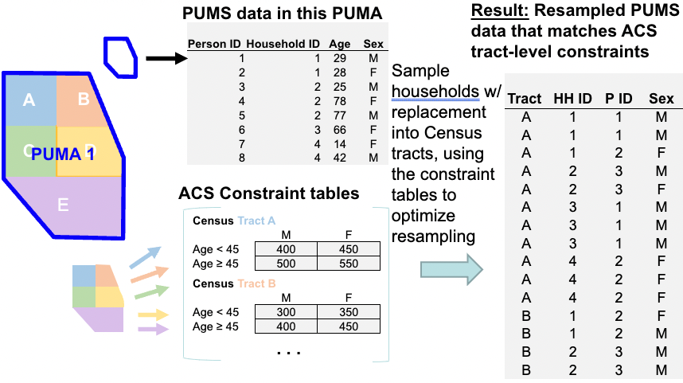

# Methods

To generate synthetic populations for each Public Use Microdata Area (PUMA) 
contained within the Mystic River Watershed area, we used a combination of 
coding languages (R version 4.2.2 (2022-10-31) and Fortran) and a combination of datasets to generate 
PUMA-specific constraint tables. Note that the geographic resolution used for these
methods is the census tract level. 

```{r methods-image,echo=FALSE,out.width=700,fig.cap="Using PUMA and ACS to Generate a Synthetic Population"}
setwd("~/Desktop/SUMMER2023/ResearchRotation/github_acres/synthpop-bookdown/")
 
```

**OVERVIEW:** 


Obtaining the datasets required: 

1. Creating lists of census tracts located in each of the 10 PUMAs using R
2. Pulling ACS census tract data for each of the 10 PUMA sets of census tracts using R
3. Pulling the Public Use Microdata Samples for each PUMA, including person and household variables

The datasets are then cleaned: 

1. ACS dataset are cleaned and combined in R (with separate runs for each PUMA)
2. PUMS data is cleaned and combined in R (with separate runs for each PUMA) 

N.B. (1) and (2) above generate output textfiles which can then be read into and implemented in the CO model, which is written in Fortran.

Update a few additional tables: 

1. Constraining tables information textfile. This file is also an output file with parameters used to reflect different ancestry bins by PUMA.
2. Control parameters file with PUMA name, number of constraint cells for that PUMA, and row below (number of constraint cells x 10).

Run with CO_BU.exe, the executable created by compiling Fortran code.  

Read the resulting output from the CO work using R. 


## Geographic area 

There are 21 cities and towns included in the Mystic River Watershed area: 

1. Burlington 
2. Lexington 
3. Belmont 
4. Watertown 
5. Arlington 
6. Winchester 
7. Woburn 
8. Reading 
9. Stoneham 
10. Medford 
11. Somerville 
12. Cambridge 
13. Boston (East Boston, Charlestown) 
14. Everett 
15. Malden 
16. Melrose 
17. Wakefield 
18. Chelsea 
19. Revere 
20. Winthrop 
21. Wilmington 


## ACS constraint tables 

ACS 5-year (2021) detailed estimates tables for Massachusetts census tracts were obtained. 

### Race/Ethnicity 

  - B04006 [People Reporting Ancestry](https://data.census.gov/table?q=B0400&g=040XX00US25&tid=ACSDT1Y2021.B04006) 
    - Collapsed by town/city: all ancestry groups with more than 1% of the population represented are retained, those with less than 1% are collapsed to 'other'
  - B03001 [Hispanic or Latino by Specific Origin](https://data.census.gov/table?q=B03001&g=040XX00US25,25$1400000) 
  
  Note that ACS 5-year (2021) detailed estimates tables include People Reporting Single Ancestry, People Reporting Multiple Ancestry, and a combined table of both - People Reporting Ancestry (B04006, used here). In order to approximate the first-ancestry reported, as this is the ancestry included in the PUMS (see section below), we did some re-weighting of the B04006 table variables. In brief, this method was as follows:   
  
  For a given PUMA (Public Use Microdata Area) in the set of 10 included PUMAs, and for each census tract within that PUMA, we re-weight all ancestry variables by proceeding across columns.   
  
  If true total $= total_{true}$ and total with multiple ancestries $= total_{obs}$, and observed population in a given ancestry column for that row $= Z_{obs}$, then the re-weighted $Z_{rw}$ is   
  
  $$
  Z_{rw} = k*Z_{obs} = {\frac{total_{obs}}{total_{true}}}*Z_{obs}
  $$
  To round to whole units of persons, we use a probabilistic coin-toss methodology:   
  
  Let the probability of rounding up be $mod(Z_{rw},1)$.  
  
  Using the 'set.seed()' function in R, generate a random number, $P$, between 0 and 1.   
  
  Then, the rounded number is:  
  
  $$
  Z_{rw-integer} = Z_{rw}-mod(Z_{rw},1)+P.
  $$
  This is helpful, except when the new total, $total_{new}$ no longer equals $total_{true}$.To amend this, we apply a 'fudge factor': 
  Rank all ancestry columns based on $Z_{rw_integer}$. Based on the difference between $total_{true}$ and $total_{new}$, we adjust the data as needed:   
  
  If $total_{new}-total_{true} = 0$, then do nothing.   
  
  If $total_{new}-total_{true} = total_{diff} > 0$, remove 1 from each of the top $n = total_{diff}$ ranked ancestries.   
  If $total_{new}-total_{true} = total_{diff} < 0$, add 1 to each of the top $n = total_{diff}$ ranked ancestries.  
  
  We keep ancestry variables where the proportion of the PUMA of that background equals or exceeds 1%. This means different ancestry variables were included for different PUMAs. The following table provides the list of included ancestries by PUMA. 
  
```{r nice-tab0, echo=FALSE, tidy=FALSE, message = FALSE, warning = FALSE}
library(readr)
PUMAS <- list("01300", "03306", "00505", "03302", "00506", "00507", "00508",
              "01000", "02800","00503")
table_list <- vector(mode = "list")
for (puma in PUMAS){
  table <- read_csv(paste0("ACS_ancestry_PUMA", puma, ".csv"))
  table_list[[puma]] <- table
}
knitr::kable(table_list[["01300"]], caption = '**PUMA01300 Ancestry Mappings**', booktabs = TRUE)
knitr::kable(table_list[["03306"]], caption = '**PUMA03306 Ancestry Mappings**', booktabs = TRUE)
knitr::kable(table_list[["00505"]], caption = '**PUMA00505 Ancestry Mappings**', booktabs = TRUE)
knitr::kable(table_list[["03302"]], caption = '**PUMA03302 Ancestry Mappings**', booktabs = TRUE)
knitr::kable(table_list[["00506"]], caption = '**PUMA00506 Ancestry Mappings**', booktabs = TRUE)
knitr::kable(table_list[["00507"]], caption = '**PUMA00507 Ancestry Mappings**', booktabs = TRUE)
knitr::kable(table_list[["00508"]], caption = '**PUMA00508 Ancestry Mappings**', booktabs = TRUE)
knitr::kable(table_list[["01000"]], caption = '**PUMA01000 Ancestry Mappings**', booktabs = TRUE)
knitr::kable(table_list[["02800"]], caption = '**PUMA02800 Ancestry Mappings**', booktabs = TRUE)
knitr::kable(table_list[["00503"]], caption = '**PUMA00503 Ancestry Mappings**', booktabs = TRUE)

```   

### Sex and Age 

  - B01001 [Sex by Age](https://data.census.gov/table?q=B01001&g=040XX00US25,25$1400000) 
  
### Education 

  - B15001 [Sex by educational attainment for the population 18 years and over](https://data.census.gov/table?q=B15001&g=040XX00US25,25$1400000) 
  

### Householder Age and Household Income 

  - B19307 [Age of householder by household income in the past 12 months (2021 inflation-adjusted dollars)](https://data.census.gov/table?q=B19037&g=040XX00US25,25$1400000) 
  
### Householder Age and Tenure 

  - B25007 [Tenure by Age of Householder](https://data.census.gov/table?q=B25007&g=040XX00US25,25$1400000) 
  


## PUMS data 

ACS 5-year (2017-2021) Public Use Microdata Sample (PUMS) files for *person* data and for *household* data. These data sample approximately 5% of individual responses to the ACS. Full documentation on this data is provided in the [PUMS User Guide](https://www2.census.gov/programs-surveys/acs/tech_docs/pums/2017_2021ACS_PUMS_User_Guide.pdf).

We have downloaded the PUMS data at the highest spatial resolution available: PUMA (Public Use Microdata Area), geographic units developed in the Decennial Census (here, 2010) of approximately 100,000 people per PUMA. 

```{r nice-tab2, echo=FALSE, tidy=FALSE}
library(readr)
person <- read_csv("PUMA_p_variables.csv")
hhold <- read_csv("PUMA_h_variables.csv")
knitr::kable(person, caption = '**Relevant PUMS Person Variables**', booktabs = TRUE)
knitr::kable(hhold, caption = '**Relevant PUMS Household Variables**', booktabs = TRUE)
```

## ACS and PUMS Mapping 

Because ACS and PUMS variables within tables differ, we create variable mappings between the two datasets for each table. Some mappings are more complex than others (like Ancestry and Hispanic/Latino(a) tables). All are made into factor variables with integers used to indicate categories. The following sections outline the mappings and factors created by constraint variable:

**Age (B01001)**

Age is a continuous variable in the PUMS dataset. We create age breaks at {0, 17, 24, 34, 44, 64, 200} and make a factor variable (1:6). 

Age is a categorical variable in the ACS dataset (as shown above). We use the following mapping to coerce the ACS data into 6 categories that will correspond to the PUMS breaks. 

```{r nice-tab3, echo=FALSE, tidy=FALSE}
library(readxl)

B01001 <- read_excel("acs_pums_mappings.xlsx", sheet = "B01001")
knitr::kable(B01001, caption = '**B01001 Mapping**',booktabs = TRUE)
```

**Sex (B01001)** 

The sex variable mappings do not require complex mappings (Male (1) and Female(2)). 

**Education (B15001)** 

The education ACS tables do not include the population under 18 years of age. In order for CO_BU.exe to function properly, the person-variables in the estimates_constraints.txt input need to sum to the respective total populations in the census tract. We complete the population for the education section of variables by calculating the remaining under 18 population (using B01001) and include this as a column in the education categories.

```{r nice-tab4, echo=FALSE, tidy=FALSE}
library(readxl)

B15001 <- read_excel("acs_pums_mappings.xlsx", sheet = "B15001")
knitr::kable(B15001, caption = '**B15001 Mapping**',booktabs = TRUE)
```

**Householder Age and Household Income (B19037)**

Mapping of householder age and household income variables requires setting breaks in PUMS variables (which are continuous integers) that correspond to the ACS categorical values for these variables.Note that householder age from B19037 contains fewer categories than householder age in B25007 (see next subsection). 

Additionally, note the added category in the ACS column for B19037 Household Income Mapping. A column of all 0 values is included in the ACS inputs to the estimation_constraints.txt data file in order to provide mapping to the NAs included in the PUMS data.

```{r nice-tab5, echo=FALSE, tidy=FALSE}
library(readxl)

B19037_age <- read_excel("acs_pums_mappings.xlsx", sheet = "B19037_age")
knitr::kable(B19037_age, caption = '**B19037 Householder Age Mapping**',booktabs = TRUE)
B19037_income <- read_excel("acs_pums_mappings.xlsx", sheet = "B19037_income")
knitr::kable(B19037_income, caption = '**B19037 Household Income Mapping**',booktabs = TRUE)
```

**Householder Age and Tenure (B25007)** 

Mapping of householder tenure requires mapping multiple PUMS tenure categories to individual ACS categories. An additional category is also created for PUMS NA values, and a column of all 0 values is included in the ACS inputs to the estimation_constraints.txt data file in order to provide mapping to the NAs included in the PUMS data.

Additionally, note the added category in the ACS column for B25007 Household Tenure Mapping. A column of all 0 values is included in the ACS inputs to the estimation_constraints.txt data file in order to provide mapping to the NAs included in the PUMS data.

```{r nice-tab6, echo=FALSE, tidy=FALSE}
library(readxl)

B25007_age <- read_excel("acs_pums_mappings.xlsx", sheet = "B25007_age")
knitr::kable(B25007_age, caption = '**B25007 Householder Age Mapping**',booktabs = TRUE)
B25007_tenure <- read_excel("acs_pums_mappings.xlsx", sheet = "B25007_tenure")
knitr::kable(B25007_tenure, caption = '**B25007 Household Tenure Mapping**',booktabs = TRUE)
```


## R Code Guide

This section details the R project structure (hereafter referred to as ACRESr.proj) implemented prior to running CO_BU.exe. 

**Step 1. Pulling ACS Data.** 
Run the following code:
[ACS] - 0 - Grab ACS Data.R  

* Objective: pull all raw census data using census API calls  

* Provide census API key. 

* Pull all custom functions (custom-functions.R). 

* Define the PUMAs with census tracts to be included in each. 
* Run through each individual file that pulls data:  
    * [ACS] - 0 - i - Ancestry.R. 
      * This script uses a reweight function (process_puma) to get the totals to
      align with the totals for other categories. 
      * This script also uses a grab_top_i_percent function to collapse the number
      of categories to those contributing at least i% of the total population.  
    * [ACS] - 0 - i - Hispanic and Latino.R   
      * This script also uses a grab_top_i_percent function to collapse the number
      of categories to those contributing at least i% of the total population.  
    * [ACS] - 0 - ii - Sex and Age.R. 
    * [ACS] - 0 - iii - Education.R. 
    * [ACS] - 0 - iv - HHage and HHincome.R. 
    * [ACS] - 0 - v - HHage and Tenure.R. 
    
**Step 2. Output Estimation Constraints and Area List.**
Run the following code:  
[ACS] - 1 - combine all.R. 

* Objective: for a given PUMA and its corresponding tracts, pull ACS columns into
  a table (estimation_constraints) and list all tracts (Area_list). 
  
  * Copy output from this script into CO_BU_MAC/Data. 
  
  * Copy printed output for calc_pearson.xlsx, and then take the resulting excel column and paste into the constraining_tables_info.txt file in CO_BU_MAC/Data. 
  
  * Go to MA census tract data/ancestry - hispanic B03001/ and copy the resulting hispanic mapping files into the script [PUMS] - 1 - i - Create Ancestry and Hispanic and Latino Mappings.R 
  
  * Go to MA census tract data/ancestry B04006/ and copy the resulting ancestry mapping files into the script [PUMS] - 1 - i - Create Ancestry and Hispanic and Latino Mappings.R 
  
**Step 3. Create Mapped Person and Mapped House files using PUMS data.** 
Run the following code: [PUMS] - 1 - Read in PUMS data.R. 

* Objective: for a given PUMA, produce person and household inputs using the PUMA, subset to the variables corresponding to those provided in the ACS table constraints used.  

  * This code runs all four [PUMS] scripts, creating mappings with [PUMS] - 1 - i - Create Ancestry and Hispanic and Latino Mappings.R, grabbing person data in [PUMS] - 1 - ii - person data.R, household data in [PUMS] - 1 - iii - house data.R, and finally creating the output files in [PUMS] - 1 - iv - convert PUMS to CO.R 

  * Copy the mapped_person, mapped_house, and house_serials text files from the ACRESr output folder into CO_BU_MAC/Data. 


## Bring into the CO model

### Prepare Data: 

As described in the R Code, you should have the following files in CO_BU_MAC/Data, as listed in CO_filelist.txt (each with the PUMA indicated at the end of the file name, except for CO_random_seednumbers.txt as this does not need to change). 

1. 'Data/mapped_house_PUMA.txt' 

2. 'Data/mapped_person_PUMA.txt' 

3. 'Data/estimation_constraints_PUMA.txt' 

4. 'Data/Area_list_PUMA.txt' 

5. 'Data/constraining_tables_info_PUMA.txt' 

6. 'Data/control_parameters_PUMA.txt' 

7. 'Data/CO_random_seednumbers.txt'  


### Phase 1: with replacement

This we will do for basic demographics, the 14 characteristics as before

### Phase 2: without replacement

This we will do once we have the housing data Jon shared

## Exporting from the CO model

