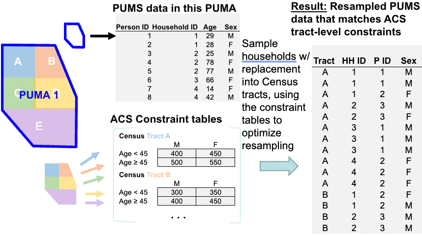

# Methods

To generate synthetic populations for each Public Use Microdata Area
(PUMA) contained within the Mystic River Watershed area, we used a
combination of coding languages (R version 4.2.2 (2022-10-31) and
Fortran) and a combination of datasets to generate PUMA-specific
constraint tables. Note that the geographic resolution used for these
methods is the census tract level.

<div class="figure">

<p class="caption">(\#fig:methods-image)Using PUMA and ACS to Generate a Synthetic Population</p>
</div>

**OVERVIEW:**

Obtaining the datasets required:

1.  Creating lists of census tracts located in each of the 10 PUMAs
    using R
2.  Pulling ACS census tract data for each of the 10 PUMA sets of census
    tracts using R
3.  Pulling the Public Use Microdata Samples for each PUMA, including
    person and household variables

The datasets are then cleaned:

1.  ACS dataset are cleaned and combined in R (with separate runs for
    each PUMA)
2.  PUMS data is cleaned and combined in R (with separate runs for each
    PUMA)

N.B. (1) and (2) above generate output textfiles which can then be read
into and implemented in the CO model, which is written in Fortran.

Update a few additional tables:

1.  Constraining tables information textfile. This file is also an
    output file with parameters used to reflect different ancestry bins
    by PUMA.
2.  Control parameters file with PUMA name, number of constraint cells
    for that PUMA, and row below (number of constraint cells x 10).

Run with **CO_BU.exe**, the executable created by compiling Fortran
code.

Read the resulting output from the CO work using R.

## Geographic area

There are 21 cities and towns included in the Mystic River Watershed
area:

1.  Burlington
2.  Lexington
3.  Belmont
4.  Watertown
5.  Arlington
6.  Winchester
7.  Woburn
8.  Reading
9.  Stoneham
10. Medford
11. Somerville
12. Cambridge
13. Boston (East Boston, Charlestown)
14. Everett
15. Malden
16. Melrose
17. Wakefield
18. Chelsea
19. Revere
20. Winthrop
21. Wilmington

## ACS constraint tables

ACS 5-year (2021) detailed estimates tables for Massachusetts census
tracts were obtained.

### Race/Ethnicity

-   B04006 [People Reporting
    Ancestry](https://data.census.gov/table?q=B0400&g=040XX00US25&tid=ACSDT1Y2021.B04006)
    -   Collapsed by town/city: all ancestry groups with more than 1% of
        the population represented are retained, those with less than 1%
        are collapsed to 'other'
-   B03001 [Hispanic or Latino by Specific
    Origin](https://data.census.gov/table?q=B03001&g=040XX00US25,25$1400000)

Note that ACS 5-year (2021) detailed estimates tables include People
Reporting Single Ancestry, People Reporting Multiple Ancestry, and a
combined table of both - People Reporting Ancestry (B04006, used here).
In order to approximate the first-ancestry reported, as this is the
ancestry included in the PUMS (see section below), we did some
re-weighting of the B04006 table variables. In brief, this method was as
follows:

For a given PUMA (Public Use Microdata Area) in the set of 10 included
PUMAs, and for each census tract within that PUMA, we re-weight all
ancestry variables by proceeding across columns.

If true total $= total_{true}$ and total with multiple ancestries
$= total_{obs}$, and observed population in a given ancestry column for
that row $= Z_{obs}$, then the re-weighted $Z_{rw}$ is

$$
  Z_{rw} = k*Z_{obs} = {\frac{total_{obs}}{total_{true}}}*Z_{obs}
  $$ To round to whole units of persons, we use a probabilistic
coin-toss methodology:

Let the probability of rounding up be $mod(Z_{rw},1)$.

Using the 'set.seed()' function in R, generate a random number, $P$,
between 0 and 1.

Then, the rounded number is:

$$
  Z_{rw-integer} = Z_{rw}-mod(Z_{rw},1)+P.
  $$ This is helpful, except when the new total, $total_{new}$ no longer
equals $total_{true}$.To amend this, we apply a 'fudge factor': Rank all
ancestry columns based on $Z_{rw_integer}$. Based on the difference
between $total_{true}$ and $total_{new}$, we adjust the data as needed:

If $total_{new}-total_{true} = 0$, then do nothing.

If $total_{new}-total_{true} = total_{diff} > 0$, remove 1 from each of
the top $n = total_{diff}$ ranked ancestries.\
If $total_{new}-total_{true} = total_{diff} < 0$, add 1 to each of the
top $n = total_{diff}$ ranked ancestries.

We keep ancestry variables where the proportion of the PUMA of that
background equals or exceeds 1%. This means different ancestry variables
were included for different PUMAs. The following table provides the list
of included ancestries by PUMA.


Table: (\#tab:nice-tab0)**PUMA01300 Ancestry Mappings**

|PUMA 01300 Ancestries >1% of Total Population |
|:---------------------------------------------|
|American                                      |
|English                                       |
|French..except.Basque.                        |
|French.Canadian                               |
|German                                        |
|Greek                                         |
|Irish                                         |
|Italian                                       |
|Polish                                        |
|Portuguese                                    |
|Scottish                                      |
|Swedish                                       |
|Unclassified.or.not.reported                  |
|Other                                         |


Table: (\#tab:nice-tab0)**PUMA03306 Ancestry Mappings**

|PUMA 03306 Ancestries >1% of Total Population |
|:---------------------------------------------|
|American                                      |
|Arab...Moroccan                               |
|Brazilian                                     |
|English                                       |
|German                                        |
|Irish                                         |
|Italian                                       |
|Polish                                        |
|Portuguese                                    |
|Unclassified.or.not.reported                  |
|Other                                         |


Table: (\#tab:nice-tab0)**PUMA00505 Ancestry Mappings**

|PUMA 00505 Ancestries >1% of Total Population |
|:---------------------------------------------|
|American                                      |
|Armenian                                      |
|Eastern.European                              |
|English                                       |
|European                                      |
|French..except.Basque.                        |
|French.Canadian                               |
|German                                        |
|Greek                                         |
|Irish                                         |
|Italian                                       |
|Polish                                        |
|Russian                                       |
|Scottish                                      |
|Swedish                                       |
|Unclassified.or.not.reported                  |
|Other                                         |


Table: (\#tab:nice-tab0)**PUMA03302 Ancestry Mappings**

|PUMA 03302 Ancestries >1% of Total Population |
|:---------------------------------------------|
|American                                      |
|English                                       |
|European                                      |
|French..except.Basque.                        |
|French.Canadian                               |
|German                                        |
|Irish                                         |
|Italian                                       |
|Polish                                        |
|Russian                                       |
|Scottish                                      |
|Unclassified.or.not.reported                  |
|Other                                         |


Table: (\#tab:nice-tab0)**PUMA00506 Ancestry Mappings**

|PUMA 00506 Ancestries >1% of Total Population  |
|:----------------------------------------------|
|American                                       |
|British                                        |
|Eastern.European                               |
|English                                        |
|European                                       |
|French..except.Basque.                         |
|German                                         |
|Irish                                          |
|Italian                                        |
|Polish                                         |
|Portuguese                                     |
|Russian                                        |
|Scottish                                       |
|Subsaharan.African...Ethiopian                 |
|Swedish                                        |
|West.Indian..except.Hispanic.groups....Haitian |
|Unclassified.or.not.reported                   |
|Other                                          |


Table: (\#tab:nice-tab0)**PUMA00507 Ancestry Mappings**

|PUMA 00507 Ancestries >1% of Total Population  |
|:----------------------------------------------|
|American                                       |
|Brazilian                                      |
|English                                        |
|European                                       |
|French..except.Basque.                         |
|French.Canadian                                |
|German                                         |
|Irish                                          |
|Italian                                        |
|Polish                                         |
|Portuguese                                     |
|Russian                                        |
|West.Indian..except.Hispanic.groups....Haitian |
|Unclassified.or.not.reported                   |
|Other                                          |


Table: (\#tab:nice-tab0)**PUMA00508 Ancestry Mappings**

|PUMA 00508 Ancestries >1% of Total Population  |
|:----------------------------------------------|
|American                                       |
|Brazilian                                      |
|English                                        |
|French..except.Basque.                         |
|French.Canadian                                |
|German                                         |
|Irish                                          |
|Italian                                        |
|Polish                                         |
|Portuguese                                     |
|Russian                                        |
|Scottish                                       |
|West.Indian..except.Hispanic.groups....Haitian |
|Unclassified.or.not.reported                   |
|Other                                          |


Table: (\#tab:nice-tab0)**PUMA01000 Ancestry Mappings**

|PUMA 01000 Ancestries >1% of Total Population |
|:---------------------------------------------|
|American                                      |
|English                                       |
|French..except.Basque.                        |
|French.Canadian                               |
|German                                        |
|Greek                                         |
|Irish                                         |
|Italian                                       |
|Polish                                        |
|Portuguese                                    |
|Russian                                       |
|Scottish                                      |
|Swedish                                       |
|Unclassified.or.not.reported                  |
|Other                                         |


Table: (\#tab:nice-tab0)**PUMA02800 Ancestry Mappings**

|PUMA 02800 Ancestries >1% of Total Population |
|:---------------------------------------------|
|American                                      |
|English                                       |
|French..except.Basque.                        |
|French.Canadian                               |
|German                                        |
|Greek                                         |
|Irish                                         |
|Italian                                       |
|Polish                                        |
|Portuguese                                    |
|Scottish                                      |
|Swedish                                       |
|Unclassified.or.not.reported                  |
|Other                                         |


Table: (\#tab:nice-tab0)**PUMA00503 Ancestry Mappings**

|PUMA 00503 Ancestries >1% of Total Population |
|:---------------------------------------------|
|American                                      |
|Armenian                                      |
|English                                       |
|European                                      |
|French..except.Basque.                        |
|French.Canadian                               |
|German                                        |
|Greek                                         |
|Irish                                         |
|Italian                                       |
|Polish                                        |
|Russian                                       |
|Scottish                                      |
|Unclassified.or.not.reported                  |
|Other                                         |

### Sex and Age

-   B01001 [Sex by
    Age](https://data.census.gov/table?q=B01001&g=040XX00US25,25$1400000)

### Education

-   B15001 [Sex by educational attainment for the population 18 years
    and
    over](https://data.census.gov/table?q=B15001&g=040XX00US25,25$1400000)

### Householder Age and Household Income

-   B19307 [Age of householder by household income in the past 12 months
    (2021 inflation-adjusted
    dollars)](https://data.census.gov/table?q=B19037&g=040XX00US25,25$1400000)

### Householder Age and Tenure

-   B25007 [Tenure by Age of
    Householder](https://data.census.gov/table?q=B25007&g=040XX00US25,25$1400000)

## PUMS data

ACS 5-year (2017-2021) Public Use Microdata Sample (PUMS) files for
*person* data and for *household* data. These data sample approximately
5% of individual responses to the ACS. Full documentation on this data
is provided in the [PUMS User
Guide](https://www2.census.gov/programs-surveys/acs/tech_docs/pums/2017_2021ACS_PUMS_User_Guide.pdf).

We have downloaded the PUMS data at the highest spatial resolution
available: PUMA (Public Use Microdata Area), geographic units developed
in the Decennial Census (here, 2010) of approximately 100,000 people per
PUMA.


```
## Rows: 8 Columns: 2
## ── Column specification ────────────────────────────────────────────────────────
## Delimiter: ","
## chr (2): Variable, Explanation
## 
## ℹ Use `spec()` to retrieve the full column specification for this data.
## ℹ Specify the column types or set `show_col_types = FALSE` to quiet this message.
## Rows: 5 Columns: 2
## ── Column specification ────────────────────────────────────────────────────────
## Delimiter: ","
## chr (2): Variable, Explanation
## 
## ℹ Use `spec()` to retrieve the full column specification for this data.
## ℹ Specify the column types or set `show_col_types = FALSE` to quiet this message.
```


Table: (\#tab:nice-tab2)**Relevant PUMS Person Variables**

|Variable |Explanation                          |
|:--------|:------------------------------------|
|AGEP     |Age                                  |
|SEX      |Sex                                  |
|ANC1P    |Ancestry                             |
|SCHL     |Educational Status                   |
|SPORDER  |Relationship to reference person     |
|HISP     |Hispanic/Non-Hispanic                |
|ID       |Identification number                |
|SERIALNO |Housing unit/GQ person serial number |


Table: (\#tab:nice-tab2)**Relevant PUMS Household Variables**

|Variable |Explanation                          |
|:--------|:------------------------------------|
|SERIALNO |Housing unit/GQ person serial number |
|TEN      |Tenure (owned/rented?)               |
|HINCP    |Household income                     |
|ADJINC   |Adjusted household income            |
|NP       |Number of people in house            |

## ACS and PUMS Mapping

Because ACS and PUMS variables within tables differ, we create variable
mappings between the two datasets for each table. Some mappings are more
complex than others (like Ancestry and Hispanic/Latino(a) tables). All
are made into factor variables with integers used to indicate
categories. The following sections outline the mappings and factors
created by constraint variable:

**Age (B01001)**

Age is a continuous variable in the PUMS dataset. We create age breaks
at {0, 17, 24, 34, 44, 64, 200} and make a factor variable (1:6).

Age is a categorical variable in the ACS dataset (as shown above). We
use the following mapping to coerce the ACS data into 6 categories that
will correspond to the PUMS breaks.


Table: (\#tab:nice-tab3)**B01001 Mapping**

|ACS Category      | Recategorization|Corresponding PUMS Factor (continuous integer breaks) |
|:-----------------|----------------:|:-----------------------------------------------------|
|Under 5 years     |                1|<18                                                   |
|5-9 years         |                1|<18                                                   |
|10-14 years       |                1|<18                                                   |
|15-17 years       |                1|<18                                                   |
|18 and 19 years   |                2|18-24                                                 |
|20 years          |                2|18-24                                                 |
|21 years          |                2|18-24                                                 |
|22-24 years       |                2|18-24                                                 |
|25-29 years       |                3|25-34                                                 |
|30-34 years       |                3|25-34                                                 |
|35-39 years       |                4|35-44                                                 |
|40-44 years       |                4|35-44                                                 |
|45-49 years       |                5|45-64                                                 |
|50-54 years       |                5|45-64                                                 |
|55-59 years       |                5|45-64                                                 |
|60 and 61 years   |                5|45-64                                                 |
|62-64 years       |                5|45-64                                                 |
|65 and 66 years   |                6|65+                                                   |
|67-69 years       |                6|65+                                                   |
|70-74 years       |                6|65+                                                   |
|75-79 years       |                6|65+                                                   |
|80-84 years       |                6|65+                                                   |
|85 years and over |                6|65+                                                   |

**Sex (B01001)**

The sex variable mappings do not require complex mappings (Male (1) and
Female(2)).

**Education (B15001)**

The education ACS tables do not include the population under 18 years of
age. In order for **CO_BU.exe** to function properly, the
person-variables in the estimates_constraints.txt input need to sum to
the respective total populations in the census tract. We complete the
population for the education section of variables by calculating the
remaining under 18 population (using B01001) and include this as a
column in the education categories.


Table: (\#tab:nice-tab4)**B15001 Mapping**

|ACS Category                            | Recategorization|Corresponding PUMS Factor                           |
|:---------------------------------------|----------------:|:---------------------------------------------------|
|Less than 9th grade                     |                2|bb 	N/A (less than 3 years old)                      |
|Less than 9th grade                     |                2|1 	(No schooling completed)                          |
|Less than 9th grade                     |                2|2 	(Nursery school, preschool)                       |
|Less than 9th grade                     |                2|3 	(Kindergarten )                                   |
|Less than 9th grade                     |                2|4 	(Grade 1)                                         |
|Less than 9th grade                     |                2|5 	(Grade 2)                                         |
|Less than 9th grade                     |                2|6 	(Grade 3)                                         |
|Less than 9th grade                     |                2|7 	(Grade 4)                                         |
|Less than 9th grade                     |                2|8 	(Grade 5)                                         |
|Less than 9th grade                     |                2|9 	(Grade 6)                                         |
|Less than 9th grade                     |                2|10 	(Grade 7)                                        |
|Less than 9th grade                     |                2|11 	(Grade 8 )                                       |
|6th to 12th grade no diploma            |                3|12 	(Grade 9)                                        |
|7th to 12th grade no diploma            |                3|13 	(Grade 10)                                       |
|8th to 12th grade no diploma            |                3|14 	(Grade 11)                                       |
|9th to 12th grade no diploma            |                3|15 	(12th grade - no diploma)                        |
|High school graduate GED or alternative |                4|16 	(Regular high school diploma)                    |
|High school graduate GED or alternative |                4|17 	(GED or alternative credential)                  |
|Some college no degree                  |                5|18 	(Some college, but less than 1 year)             |
|Some college no degree                  |                5|19 	(1 or more years of college credit, no degree)   |
|Associate degree                        |                5|20 	(Associate's degree)                             |
|Bachelor degree                         |                6|21 	(Bachelor's degree)                              |
|Graduate or professional degree         |                7|22 	(Master's degree)                                |
|Graduate or professional degree         |                7|23 	(Professional degree beyond a bachelor's degree) |
|Graduate or professional degree         |                7|24 	(Doctorate degree)                               |
|Below 18 years Old                      |                1|Not included in PUMS                                |

**Householder Age and Household Income (B19037)**

Mapping of householder age and household income variables requires
setting breaks in PUMS variables (which are continuous integers) that
correspond to the ACS categorical values for these variables.Note that
householder age from B19037 contains fewer categories than householder
age in B25007 (see next subsection).

Additionally, note the added category in the ACS column for B19037
Household Income Mapping. A column of all 0 values is included in the
ACS inputs to the estimation_constraints.txt data file in order to
provide mapping to the NAs included in the PUMS data.


Table: (\#tab:nice-tab5)**B19037 Householder Age Mapping**

|ACS Category                  | Recategorization|Corresponding PUMS Factor (continuous integer breaks) |
|:-----------------------------|----------------:|:-----------------------------------------------------|
|Householder under 25 years    |                1|<25                                                   |
|Householder 25-44 years       |                2|25-44                                                 |
|Householder 45-64 years       |                3|45-64                                                 |
|Householder 65 years and over |                4|>64                                                   |


Table: (\#tab:nice-tab5)**B19037 Household Income Mapping**

|ACS Category                                                                | Recategorization|Corresponding PUMS Factor (continuous integer breaks) |
|:---------------------------------------------------------------------------|----------------:|:-----------------------------------------------------|
|Less than 10000                                                             |                1|<10000                                                |
|10000-14999                                                                 |                2|10000-14999                                           |
|15000-19999                                                                 |                3|15000-19999                                           |
|20000-24999                                                                 |                4|20000-24999                                           |
|25000-29999                                                                 |                5|25000-29999                                           |
|30000-34999                                                                 |                6|30000-34999                                           |
|35000-39999                                                                 |                7|35000-39999                                           |
|40000-44999                                                                 |                8|40000-44999                                           |
|45000-49999                                                                 |                9|45000-49999                                           |
|50000-59999                                                                 |               10|50000-59999                                           |
|60000-74999                                                                 |               11|60000-74999                                           |
|75000-99999                                                                 |               12|75000-99999                                           |
|100000-124999                                                               |               13|100000-124999                                         |
|125000-149999                                                               |               14|125000-149999                                         |
|150000-199999                                                               |               15|150000-199999                                         |
|200000 or more                                                              |               16|>=200000                                              |
|NA (Created column where all rows == 0 to match number of PUMS  categories) |               17|NA                                                    |

**Householder Age and Tenure (B25007)**

Mapping of householder tenure requires mapping multiple PUMS tenure
categories to individual ACS categories. An additional category is also
created for PUMS NA values, and a column of all 0 values is included in
the ACS inputs to the estimation_constraints.txt data file in order to
provide mapping to the NAs included in the PUMS data.

Additionally, note the added category in the ACS column for B25007
Household Tenure Mapping. A column of all 0 values is included in the
ACS inputs to the estimation_constraints.txt data file in order to
provide mapping to the NAs included in the PUMS data.


Table: (\#tab:nice-tab6)**B25007 Householder Age Mapping**

|ACS Category                  | Recategorization|Corresponding PUMS Factor (continuous integer breaks) |
|:-----------------------------|----------------:|:-----------------------------------------------------|
|Householder 15-24 years       |                1|<25                                                   |
|Householder 25-34 years       |                2|25-34                                                 |
|Householder 35-44 years       |                3|35-44                                                 |
|Householder 45-54 years       |                4|45-54                                                 |
|Householder 55-59 years       |                5|55-59                                                 |
|Householder 60-64 years       |                6|60-64                                                 |
|Householder 65-74 years       |                7|65-74                                                 |
|Householder 75-84 years       |                8|75-84                                                 |
|Householder 85 years and over |                9|>-85                                                  |


Table: (\#tab:nice-tab6)**B25007 Household Tenure Mapping**

|ACS Category                                                                | Recategorization|Corresponding PUMS Factor                                   |
|:---------------------------------------------------------------------------|----------------:|:-----------------------------------------------------------|
|Owner occupied                                                              |                1|1 (Owned with mortgage or loan (include home equity loans)) |
|Owner occupied                                                              |                1|2 (Owned free and clear)                                    |
|Renter occupied                                                             |                2|3 (Rented)                                                  |
|Renter occupied                                                             |                2|4 (Occupied without payment of rent)                        |
|NA (Created column where all rows == 0 to match number of PUMS  categories) |                3|N/A (GQ/vacant)                                             |

## The Code:

*Attention: Before you begin -* clone or download the following GitHub
Repository: <https://github.com/Flannery-BIng/synth_pop>

In this repository, you will see two subfolders:

-   ACRESr

-   CO_BU

All R scripts are within the ACRESr folder and all Fortran scripts are
within the CO_BU folder. Where possible, we have provided example output
files and the folder and subfolder structures that will allow you to
reproduce our code output.

### 1. PUMA data

**Step 1. Download housing and person level PUMA data here:**

<https://data.census.gov/app/mdat/ACSPUMS5Y2021>

*Make sure you select the PUMA variables listed above (see section
titled **PUMS data**).*

**Step 2. Place the PUMA data in a subfolder of the ACRESr project
directory titled ACS_PUMS**

### 2. Prepare ACS data for CO model

This section details the R project structure (hereafter referred to as
ACRESr.proj) implemented prior to running **CO_BU.exe**.\

**Step 1. Pulling ACS Data.** Run the following code (only need to run
1x): **[ACS] - 0 - Grab ACS Data.R**

Objectives:

-   Pull all raw census data using census API calls.

-   Provide census API key.

-   Pull all custom functions (custom-functions.R).

-   Define the PUMAs with census tracts to be included in each.

-   Run through each individual file that pulls data:

    -   **[ACS] - 0 - i - Ancestry.R**
        -   This script uses a reweight function (process_puma) to get
            the totals to align with the totals for other categories.
        -   This script also uses a grab_top_i_percent function to
            collapse the number of categories to those contributing at
            least i% of the total population.\
    -   **[ACS] - 0 - i - Hispanic and Latino.R**
        -   This script also uses a grab_top_i_percent function to
            collapse the number of categories to those contributing at
            least i% of the total population.\
    -   **[ACS] - 0 - ii - Sex and Age.R**
    -   **[ACS] - 0 - iii - Education.R**
    -   **[ACS] - 0 - iv - HHage and HHincome.R**
    -   **[ACS] - 0 - v - HHage and Tenure.R**

**Step 2. Output Estimation Constraints and Area List.** Run the
following code (run 1x per PUMA, adjusting inputs for lines 16-18):**\
[ACS] - 1 - combine all.R**

Objectives:

-   For a given PUMA and its corresponding tracts, pull ACS columns into
    a table (estimation_constraints) and list all tracts (Area_list).

To do after running:

-   Copy output from this script into CO_BU/Data.

-   Copy printed output for calc_pearson.xlsx, and then take the
    resulting excel column and paste into the
    constraining_tables_info.txt file in CO_BU/Data.

-   Go to MA census tract data/ancestry - hispanic B03001/ and copy the
    resulting hispanic mapping files into the script [PUMS] - 1 - i -
    Create Ancestry and Hispanic and Latino Mappings.R

-   Go to MA census tract data/ancestry B04006/ and copy the resulting
    ancestry mapping files into the script [PUMS] - 1 - i - Create
    Ancestry and Hispanic and Latino Mappings.R

**Step 3. Create Mapped Person and Mapped House files using PUMS data.**
Run the following code: **[PUMS] - 1 - Read in PUMS data.R** (run 1x per
PUMA, adjusting lines 39 and 40).

Objectives:

-   For a given PUMA, produce person and household inputs using the
    PUMA, subset to the variables corresponding to those provided in the
    ACS table constraints used.

    -   This code runs all four [PUMS] scripts, creating mappings with
        **[PUMS] - 1 - i - Create Ancestry and Hispanic and Latino
        Mappings.R**, grabbing person data in **[PUMS] - 1 - ii - person
        data.R**, household data in **[PUMS] - 1 - iii - house data.R**,
        and finally creating the output files in **[PUMS] - 1 - iv -
        convert PUMS to CO.R**

To do after running:

-   Copy the mapped_person, mapped_house, and house_serials text files
    from the ACRESr output folder into CO_BU/Data.

### 3. Bring into the CO model

#### Prepare Data

As described in the R Code, you should have the following files in
CO_BU/Data, as listed in CO_filelist.txt (each with the PUMA indicated
at the end of the file name, except for CO_random_seednumbers.txt as
this does not need to change).

1.  'Data/mapped_house_PUMA.txt'

2.  'Data/mapped_person_PUMA.txt'

3.  'Data/estimation_constraints_PUMA.txt'

4.  'Data/Area_list_PUMA.txt'

5.  'Data/constraining_tables_info_PUMA.txt'

6.  'Data/control_parameters_PUMA.txt'

    -   Correct line 3 to reflect the name of the folders where you
        would like the output from CO_BU run to go (see within Estimates
        and Estimate_Fit). Suggested label: PUMA#.
    -   Correct lines 7 and 8 to reflect the number of constraint cells
        (line 7) (see calc_pearson.xlsx for this) and the number of
        constraint cells scaled by 10x (line 8).

7.  'Data/CO_random_seednumbers.txt'

#### Run CO_BU.exe

In the terminal, with the directory set to the co-bu-mac folder, run the
following:

1.  The make file, make.sh using the code:

    cd Code

    sh make.sh

2.  Then, in order to run the executable (should see the executable has
    been created in the co-bu-mac folder):

    cd ..

    codesign -s - CO_BU

    [Why codesign? See here for
    explanation.](https://eclecticlight.co/2020/08/22/apple-silicon-macs-will-require-signed-code/)

3.  Run the executable:

    co-bu-mac % ./CO_BU

#### Read the output and check error

1.  Run [RESULTS] - Read CO output.R:

    Calls on each of the individual PUMAs and saves the output from the
    executable for each as an '.rds' file.

2.  Run [RESULTS] - 2 - Check OTAE.R:

Overall total average error (OTAE): To check the overall total average
errors, run this code which pulls all OTAE per household estimates by
PUMA and produces a boxplot of the distribution of error by PUMA.

### 4. Create parcel-level synthetic population

Parcel data can be sourced from state-websites. For Massachusetts, this
is a shapefile with a range of available variables [@massgis_parcels].
Before we can proceed with the matching algorithm, we need to do some
data preparation.

#### Parcel centroids and PUMAs

Find the centroids of parcels (we did this in GIS, could also do this in
R).

**01 - [SYNTHPOP] - Joining parcels-tracts-pumas.R**

-   Joins the geometries (tract to PUMA, parcel centroid to tract)

#### Imputation

Conduct any necessary imputation on parcel data and synthetic population
data. Example code for imputation of synthetic population data is
available here:

**02 - [SYNTHPOP] - Impute Synthpop.R**

#### Downscale from tract-level to parcel-level

To downscale further, we need additional data. For this project, we used
the MassGIS Property Tax Parcels dataset [@massgis_parcels]. The key
variables used from this dataset for this step were:

-   Number of rooms
-   Year Built
-   Total value

We conduct the matching and random allocation in the final 'synthpop'
code file:

**03 - [SYNTHPOP] - Expand MassGIS-Tract to Parcel.R**
